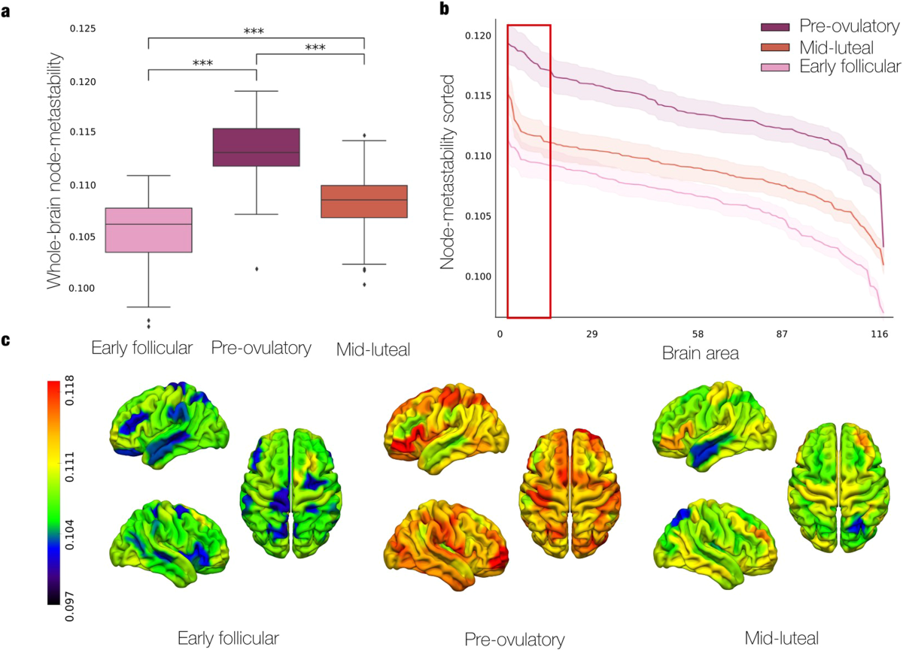
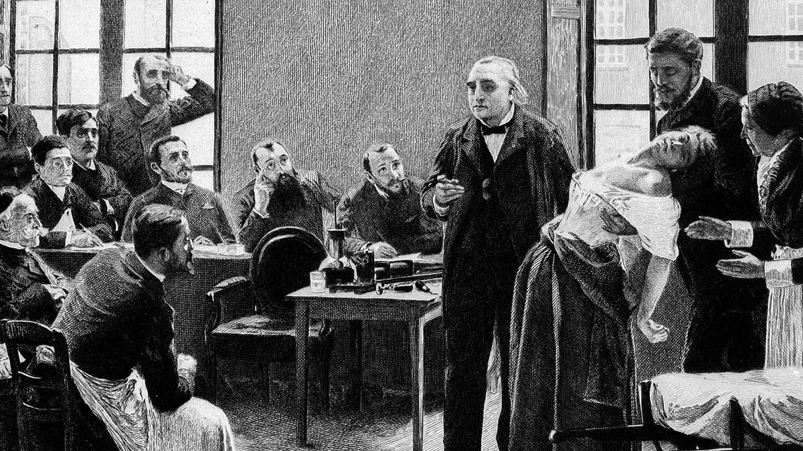
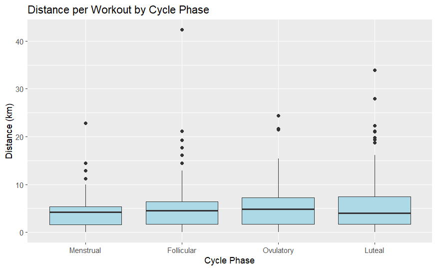
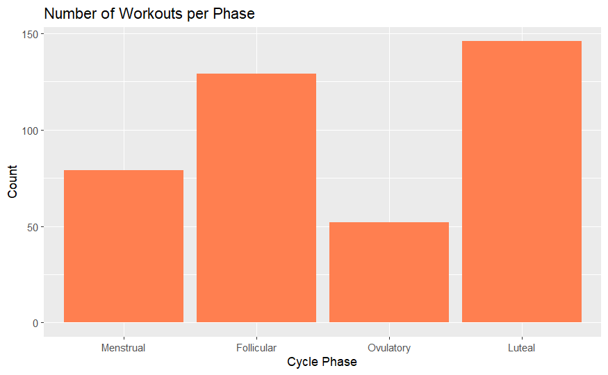
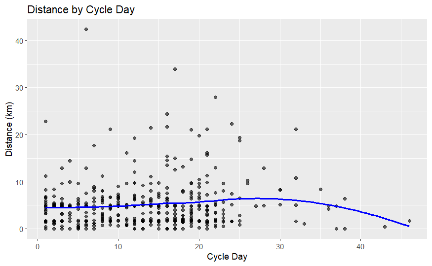
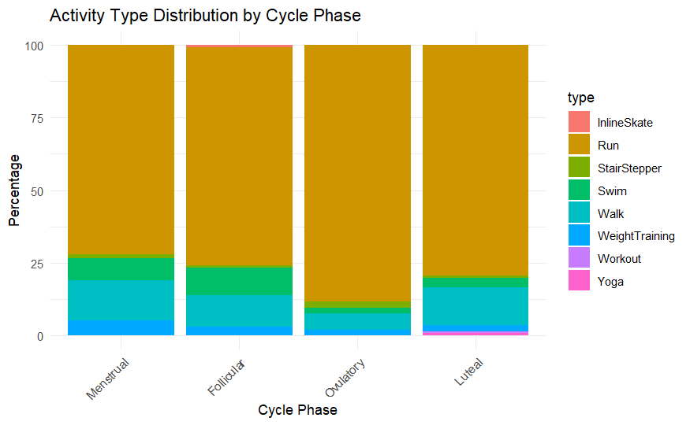
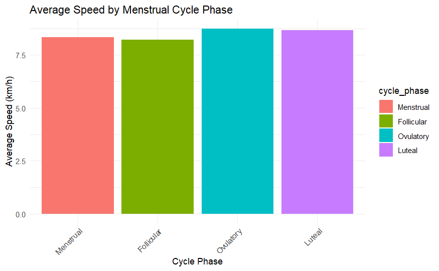

```{r setup, include=FALSE}
knitr::opts_chunk$set(echo = TRUE)
```

---
## Abstract

This study explores the relationship between an individual's menstrual cycle and movement behaviors, rooted in the hypothesis that the mind and body are deeply interconnected — that our body's physiological changes (i.e. hormonal fluctuations) are influencing our mind (independent of whether we are aware of these changes), and what is happening in our mind manifests in our bodies. Using my personal movement data alongside manually tracked menstrual cycle dates, workouts were categorized by cycle phase and analyzed for patterns in distance, frequency, and pace. While statistical tests (ANOVA) did not reveal significant differences across phases, visualizations suggest a cyclical rhythm in performance and activity. These findings support a growing body of self-reflective evidence and contribute to the foundation of a larger vision: **creating the ultimate health toolkit designed to align our internal and external worlds**. This data exploration is founded on the principle that we are the CEOs of our own health -- we are our body's own healers. We have the immense capability to heal ourselves, *we just need to understand how to activate it*.

## Introduction

This project explores the relationship between menstrual cycle phases and exercise patterns, using movement data as a lens to examine the body’s natural rhythms. The question at its core is simple: *How does the menstrual cycle influence how we move, if at all?* Using self–tracked Strava activity data alongside manually logged cycle dates, this exploratory study aims to uncover patterns between physical behavior and internal physiological states.

The motivation for this research stems from a personal health journey — one that began with confusion and a feeling of disconnect from my body, but gradually evolved into a process of awareness and alignment, where I realized how powerful and capable my body truly was. Through experience, it became clear that fluctuations in energy, focus, and motivation across the month were not random, but patterned. These patterns began to align with the phases of the menstrual cycle, revealing the cycle not as a disruption, but as a **tool — a powerful framework for understanding and supporting one’s physical and mental performance**.

```{r, echo=FALSE, out.extra='style="display:block; margin-left:auto; margin-right:auto;"'}

cat('Figure 1: Changes in the brain across the menstrual cycle.')

```

### The Problem: Women's Health Black Box

Despite the critical role a woman's hormonal cycle plays in her health, it remains vastly under-researched and poorly understood. There are huge gaps in the data, leading to a fragmented understanding of the true scope of women's health. Decisions such as excluding women from clinical trials for decades or only allocating 4% of health research funding to women's specific health needs further exacerbates the issue. The cycle is increasingly recognized as a “fifth vital sign,” yet this recognition has not translated into holistic, actionable insights for the everyday woman. As a result, many are left unequipped to understand their bodies, let alone optimize them.

```{r, echo=FALSE, out.extra='style="display:block; margin-left:auto; margin-right:auto;"'}

cat('Figure 2:‘Hysteria’: A Catch-All Diagnosis for the Unknown in Women’s Health.')

```

This project hypothesizes that movement behaviors — including frequency, distance, and pace — reflect underlying hormonal and cognitive shifts across the menstrual cycle. By mapping physical activity against cycle phases, it seeks to support the idea that the **mind and body are not separate, but deeply intertwined — and that the *behaviors we observe are often a reflection of the internal patterns we cannot always see.***

## Methods
### Data Description

This study draws on two primary data sources: **personal activity data** retrieved from Strava via its official API, and a manually created dataset of my **menstrual cycle start and end dates**. **Strava is a fitness tracking app that records and analyzes physical activities like running, cycling, and walking using GPS data**, and the dataset includes time series data for each workout, capturing variables such as start_date, activity type, distance (in meters), and moving time (in seconds). I used Strava to collect my data because it offered a consistent, timestamped record of my workouts, which allowed me to explore how my movement habits varied in relation to different phases of my menstrual cycle.
These data points were collected through authenticated API requests and returned in JSON format. To contextualize the movement patterns, a table of cycle start dates spanning nearly two years was manually constructed to define each cycle window.

### Data Gathering

```{r, echo=FALSE, out.extra='style="display:block; margin-left:auto; margin-right:auto;"'}
cat('Authenticating via OAuth to get Strava access token')
```
```{r, eval=FALSE}
client_id <- "138275"
response_type <- "code"
redirect_uri <- "http://localhost"
scope <- "read,activity:read"

auth_url <- paste0(
  "https://www.strava.com/oauth/authorize?client_id=", client_id,
  "&response_type=code&redirect_uri=", redirect_uri,
  "&approval_prompt=force&scope=", scope
)

browseURL(auth_url)

```

```{r, echo=FALSE, out.extra='style="display:block; margin-left:auto; margin-right:auto;"'}
cat('Pulling all my activities from Strava')
```
```{r, eval=FALSE}
library(httr)
library(jsonlite)
library(dplyr)

# Access token from earlier
access_token <- token

# Function to fetch one page of activities
get_strava_activities <- function(page_num, token) {
  url <- "https://www.strava.com/api/v3/athlete/activities"
  response <- GET(url, 
                  query = list(per_page = 200, page = page_num),
                  add_headers(Authorization = paste("Bearer", token)))
  
  cat("Page", page_num, "status:", status_code(response), "\n")
  
  if (status_code(response) != 200) {
    warning("Failed to retrieve page ", page_num)
    return(NULL)
  }
  
  content(response, as = "parsed", simplifyDataFrame = TRUE)
}

# Loop to collect all pages
all_activities <- list()
page <- 1

repeat {
  activities <- get_strava_activities(page, access_token)
  
  if (is.null(activities) || length(activities) == 0) {
    cat("✅ No more data. Fetched", page - 1, "pages.\n")
    break
  }
  
  all_activities[[page]] <- activities
  page <- page + 1
}
# Combine into one dataframe
strava_df <- bind_rows(all_activities)
```

### Data Processing and Wrangling

```{r, echo=FALSE, out.extra='style="display:block; margin-left:auto; margin-right:auto;"'}
cat('Cleaning and enhancing the data')
```

```{r eval=FALSE}
strava_df <- strava_df %>%
  mutate(
    start_date = as.Date(start_date_local),
    distance_km = round(distance / 1000, 2),
    moving_time_min = round(moving_time / 60, 1)
  ) %>%
  select(name,
    start_date,
    type,
    distance_km,
    moving_time_min)
```

The raw Strava data was first cleaned and transformed to enhance interpretability. Distance was converted to kilometers and moving time to minutes. The menstrual cycle data was then merged with the Strava dataset by aligning workout dates with the corresponding cycle window. Two derived variables were created for each workout:


* **Cycle Phase**: Based on the day within the cycle, each workout was categorized as occurring in one of four phases — Menstrual (Days 1–5), Follicular (Days 6–13), Ovulatory (Days 14–16), or Luteal (Days 17+).

* **Cycle Day**: A numeric variable that represents the number of days since the beginning of that cycle (starting at Day 1).

A unique cycle_id was also created to link each workout to its respective cycle, allowing for grouped analysis.

```{r, echo=FALSE, out.extra='style="display:block; margin-left:auto; margin-right:auto;"'}
cat('Combining Movement Data with Cycle Data after cleaning ')
```
```{r eval=FALSE}
strava_df$cycle_phase <- sapply(strava_df$start_date, get_cycle_phase, cycle_df = cycle_data)
```

### Visualizations

#### Data Summary Table
```{r, echo=FALSE}
my_table <- data.frame(
  `cycle_phase` = c("Menstrual", "Follicular", "Ovulatory", "Luteal"),
  `workout_count` = c(79, 129, 52, 146),
  `avg_distance_km` = c(4.243797, 4.935814, 5.930769, 5.660822),
  `avg_moving_time_min` = c(34.48354, 37.09767, 44.75577, 42.35548),
  `avg_speed_km_hr` = c(8.341396, 8.227338, 8.734060, 8.660566)
)

# Display the table
knitr::kable(my_table, caption = "Summary of Workout Metrics by Cycle Phase")
```

A wide range of visualizations were used to identify and explore patterns in movement across the menstrual cycle. These included:

* Boxplots showing distance across cycle phases

```{r, echo=FALSE, out.extra='style="display:block; margin-left:auto; margin-right:auto;"'}
cat('Chart 1: Distance by Cycle Phase')

```

* Bar charts depicting frequency of workouts by phase

```{r, echo=FALSE, out.extra='style="display:block; margin-left:auto; margin-right:auto;"'}
cat('Chart 2: Frequency of Workouts by Phase')

```

* Scatterplots of distance by cycle day with smoothed trendlines
```{r, echo=FALSE, out.extra='style="display:block; margin-left:auto; margin-right:auto;"'}
cat('Chart 3: Moving Distance by Cycle Day')

```

* Stacked bar charts representing the distribution of activity types by phase
```{r, echo=FALSE, out.extra='style="display:block; margin-left:auto; margin-right:auto;"'}
cat('Chart 4: Activity Distribution by Cycle Phase')

```

* Summary bar charts comparing average distance and speed per phase
```{r, echo=FALSE, out.extra='style="display:block; margin-left:auto; margin-right:auto;"'}
cat('Chart 5: Average Speed by Cycle Phase')

```

* ANOVA (Analysis of Variance) tests to determine whether average distance, moving time, or pace varied significantly across menstrual cycle phases.

```{r, echo=FALSE, message=FALSE, warning=FALSE}


# Create ANOVA results table
anova_results <- data.frame(
  Term = c("cycle_phase", "Residuals"),
  Df = c(3, 381),
  `Sum Sq` = c(129, 23831),
  `Mean Sq` = c(43.08, 62.55),
  `F value` = c(0.689, NA),
  `Pr(>F)` = c(0.559, NA)
)
knitr::kable(anova_results, caption = "ANOVA Results: Pace by Menstrual Cycle Phase")


```

 

## Results

To explore how movement patterns may shift across the menstrual cycle, workouts were categorized by cycle phase and cycle day. Multiple visualizations and statistical tests were used to identify trends in **distance, frequency, speed, and activity type**.

### Phase-Based Movement Patterns
Boxplots comparing workout distance across menstrual phases revealed variation in performance, with slightly higher distances observed during the follicular and ovulatory phases. However, there was overlap across all four phases, indicating high individual variability.

A bar chart displaying the frequency of workouts showed that most activities occurred during the follicular and luteal phases, with fewer workouts logged during the menstrual phase. This may reflect a natural dip in energy or a conscious reduction in activity during menstruation. However, it is important to note that the menstrual phase and ovulatory phase are shorter than the follicular and luteal phases which may influence the results. 

Summary bar charts further showed that average speed and distance were highest in the ovulatory phase and lowest in the follicular phase. These findings suggest a cyclical rhythm in movement behavior, aligning loosely with expected physiological trends (e.g., rising estrogen during the follicular phase).

### Cycle Day Patterns
When plotting distance against cycle day, a nonlinear trend emerged. Smoothed lines showed a dip in distance during early menstruation, a gradual rise through the follicular phase, and a slight decline post-ovulation — offering a more granular view of how performance may shift across the entire cycle.

### Activity Type Distribution
Stacked bar charts revealed shifts in activity type by phase. While running was the most common activity across all phases, the relative frequency of other activities such as walking and cross-training varied slightly. These shifts may indicate phase-dependent preferences in movement type or intensity. It is also important to note that I mainly utilize Strava as an app to track my running activity, which impacts the variety of the types of movement logged (and does not paint a holistic picture of my movement behaviors).

### Statistical Analysis
ANOVA tests were conducted to determine whether average distance, moving time, and pace significantly differed across cycle phases. While visual patterns suggested trends, none of the ANOVA results reached statistical significance (p > 0.05), likely due to sample size and high within-group variability. These results underscore the exploratory nature of the study.


## Discussion/Conclusion

This project was never just about movement — it was about meaning. At its core lies a belief that the body and mind are not separate systems, but **reflections of one another** — or rather, *one and the same*. What we think affects how we move. What we feel in our body echoes in our mind. By mapping physical activity onto the hormonal landscape of the menstrual cycle, this work explored how visible behaviors might mirror invisible rhythms within.

Though statistical significance wasn’t found, visual trends painted a different picture: movement behaviors appeared to follow a cyclical cadence. These patterns — subtle but consistent — affirmed what was first felt intuitively: that our cycles are not disruptions, but guides. This reflects a deeper truth too often missing in women’s health — that our biology holds intelligence, ***if only we learn how to listen***.

What this project revealed most clearly is what today’s health tools fail to provide: context. They track behaviors — steps, calories, heart rate — but rarely help us understand the why behind how we feel. More critically, they are not designed with the full picture of women’s health in mind. Hormonal rhythms, emotional fluctuations, cycle-specific needs — these nuances are often left out, flattening our experience into generic metrics. As a result, what gets measured is only a fraction of what matters. We’re handed data without meaning, and asked to optimize without understanding. **It's time we changed that.**
We are standing at a threshold. Technology is advancing faster than ever — and with it comes an extraordinary opportunity to reclaim agency over our own health. The question now becomes: *how can we use AI — intelligence on tap — to unlock the mysteries of our bodies and minds?*

This data exploration — grounded in lived experience — serves as a foundation for a larger vision: the development of a women’s health toolkit. A tool that learns and evolves with the individual. One that meets each person exactly where they are, with no expectation to perform, but with the intention to understand. A tool that collects not just data points, but stories — that interprets not just symptoms, but signals. A system that remembers, reflects, and refines alongside the user, continuously deepening its understanding of their unique physiology, patterns, and needs.

**This toolkit is not just about optimization — *it is about alignment***. It is a reclamation of our own inner authority, a quiet but powerful resistance against one-size-fits-all models of health. In its final form, it becomes more than just an app — it becomes a mirror. One that reminds women of the intelligence embedded in their biology, and offers the support needed to live in harmony with it.

This project is one step on a long, unknown, and exciting journey toward deeper self-understanding. What began as a personal curiosity has transformed into both a passion and a responsibility — a calling to change the way we approach women’s health. My own health journey over the years has not been without its challenges, but through it all I’ve built something stronger than certainty: self-belief. Learning to understand and trust my body was not a side effect of this work — it was the foundation. As Paul Graham wrote, "Live in the future, then build what’s missing.” I’ve lived the gap. Now, I’m building what I wish I had — for myself, and for every woman who’s ever felt like her body was a mystery. 

For those ready to pave a new way forward. 

Let this work be an invitation: to listen inward, to honor the body, and to remember the immense power that lives in **knowing one’s Self**.

Follow the evolution at <https://www.racheltomasetti.com/>


## Bibliography/References
- Avila-Varela, D. S., Hidalgo-Lopez, E., Dagnino, P. C., Acero-Pousa, I., del Agua, E., Deco, G., Pletzer, B., & Escrichs, A. (2024, April 1). Whole-brain dynamics across the menstrual cycle: The role of hormonal fluctuations and age in healthy women. Nature News. <https://www.nature.com/articles/s44294-024-00012-4> 

- The strava API. Strava Developers. (n.d.). <https://developers.strava.com/> 

- Bibliophilopolis. (2017, July 11). The future is now by Katherine Anne Porter – Selection #23 of Deal Me In 2017. <https://bibliophilica.wordpress.com/2017/07/11/selection-23/>

- The White House. (2024, October 23). Fact sheet: Biden-Harris administration announces $110 million in awards from ARPA-H’s Sprint for Women’s Health to accelerate new discoveries and innovation. <https://www.whitehouse.gov/briefing-room/statements-releases/2024/10/23/fact-sheet-biden-harris-administration-announces-110-million-in-awards-from-arpa-hs-sprint-for-womens-health-to-accelerate-new-discoveries-and-innovation/>

- Scully, D. (1994). Men who control women’s health: The miseducation of obstetrician-gynecologists (Reissued with a new introduction). Teachers College Press.

- Grand View Research. (n.d.). Women’s health app market size | Industry report, 2030. <https://www.grandviewresearch.com/industry-analysis/womens-health-app-market>

- Prior, J. C., & Baxter, S. (2009). The estrogen errors: Why progesterone is better for women’s health (1st ed.). Praeger. <https://doi.org/10.5040/9798400647505>

- Lin, G., Lessard, P. W., Le, M. N., Siddiqui, R., & Soh, H. (2024). Functional design requirements to facilitate menstrual health data exploration. In Proceedings of the CHI Conference on Human Factors in Computing Systems (pp. 1–15). ACM. <https://doi.org/10.1145/3613904.3642282>

- Lin, G., Siddiqui, R., Lin, Z., Soh, H., & Le, M. N. (2023). Blood glucose variance measured by continuous glucose monitors across the menstrual cycle. NPJ Digital Medicine, 6(1), 140. <https://doi.org/10.1038/s41746-023-00884-x>

- Buehler, M. J. (2024). Accelerating scientific discovery with generative knowledge extraction, graph-based representation, and multimodal intelligent graph reasoning. Machine Learning: Science and Technology, 5(3), 035083. <https://doi.org/10.1088/2632-2153/ad7228>

- Pelz, M. (2023, March 7). Dr. Mindy Pelz on the truth about birth control, hormones, cortisol, fasting & cycle syncing [Audio podcast episode]. In M. Gethin (Host), The School of Greatness. Apple Podcasts. <https://podcasts.apple.com/us/podcast/dr-mindy-pelz-on-the-truth-about-birth-control/id1655979078?i=1000603890359>

- Hyman, M. (2024, July 22). Hormone health secrets every woman needs to know [Audio podcast episode]. The Doctor’s Farmacy. <https://drhyman.com/blogs/content/podcast-ep925>

- Sims, S. (2024). Dr. Stacy Sims: Female-specific exercise & nutrition for health, performance & longevity [Audio podcast episode]. Huberman Lab. <https://open.spotify.com/episode/0C4NGR78gbSSB2JrgkhwFD>

- Jaya, J. C. (2024, October 31). A system of agents brings service-as-software to life. Foundation Capital. <https://foundationcapital.com/system-of-agents/>

- National Science Foundation. (2024, November 4). Harnessing AI to bridge gaps in women’s health care. <https://new.nsf.gov/science-matters/harnessing-ai-bridge-gaps-womens-health-care>


